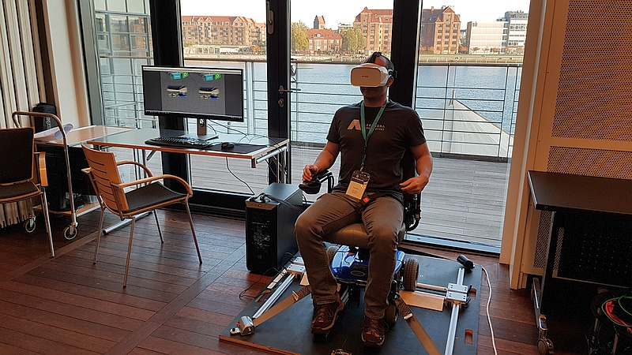

# Low-cost wheelchair simulator
Project from the Technical [University of Denmark (DTU)](http://www.dtu.dk/), [department of Management Engineering](http://www.man.dtu.dk/), 2017-2018.

Wheelchair simulator with physical encoders and a Unity 3D user interface for VR.

## Bill of materials, and mechanical drawings
The total cost (without VR, computer, etc.) is approximatively 250 USD and takes ~10 hours to assemble.

* [Components for Whee'llConnect](./documentation/Components for Whee'llConnect.pdf)

## Firmware for the Arduino encoders
* [Wheelchairduino](https://github.com/DTU-R3/Wheelchairduino)

## Unity 3D user interface
* [Wheelchair Controller Demo.zip](Wheelchair Controller Demo.zip) (excluding 3D objects)

## Contact
* [John Paulin Hansen](http://orbit.dtu.dk/en/persons/john-paulin-hansen(119e0e25-cbb9-478c-bee2-db6d2d9c4b90).html)

## Publication
* Submitted - coming soon

## Related
* See also our [DTU-R3](https://dtu-r3.github.io/) project involving a remotely driving a physical robot.
